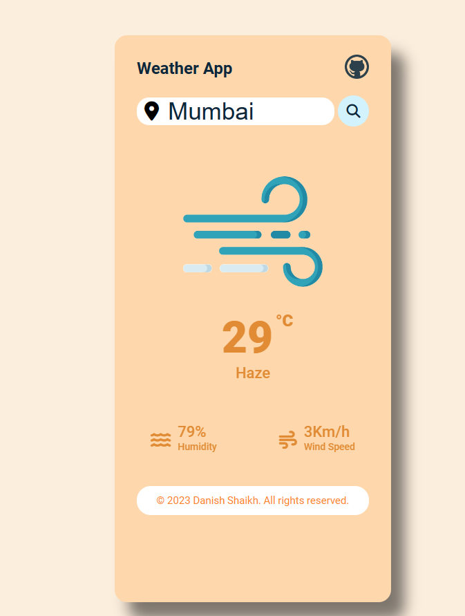

# Weather App

The Weather App is a simple web application that allows users to get weather information based on their location input. It displays the current temperature, weather description, humidity, wind speed, and additional weather details.

## Features

- **Location Input**: Enter your location to get the weather information.
- **Current Weather**: Get the current temperature and weather description.
- **Additional Weather Details**: View additional weather details such as humidity, wind speed, and more.
- **Error Handling**: Display an error message for invalid locations.
- **Responsive Design**: The app is designed to work well on different screen sizes.

## Technologies Used

- HTML
- CSS
- JavaScript
- OpenWeatherMap API

## Usage

1. Clone the repository:
   ```bash
   git clone https://github.com/DaanishShaikh/WeatherApp.git
   ```
2. Open the index.html file in your web browser.

3. Enter your location in the search box.

4. Press Enter or click the search button to get the weather information.

5. The weather details will be displayed below the search box.

## Screenshots



## License

This project is licensed under the [MIT License](LICENSE).

## Credits
- AsmrProg: Original Idea and template code.
- Weather data provided by [OpenWeatherMap API](https://openweathermap.org/)
- Icon credits: [Flaticon](https://www.flaticon.com/)

## Contributing

Contributions are welcome! If you have any ideas, suggestions, or improvements, please open an issue or submit a pull request.
